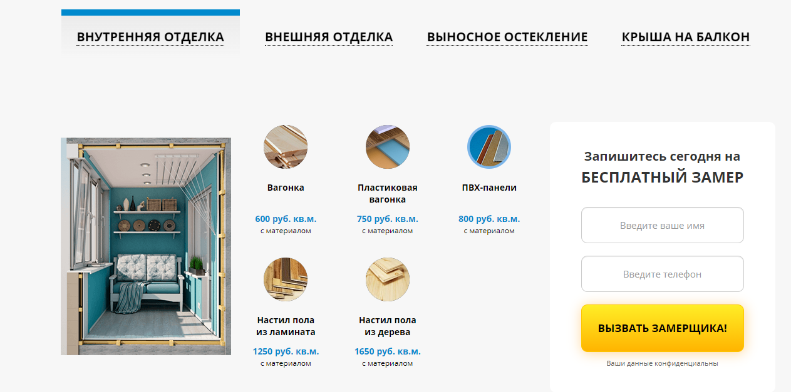

# Irvas-windows-shop-page
- project page to order balcony and loggia 
- fully responsive website in russian language
 
## General info
My purpose was to make page interactive using native JavaScript. Also I used Gulp to automate my workflow.

## Screenshots




## Features
List of features ready:
* cost calculation form
* tabs
* product filter
* registration form
* sliders

## Status
Project is finished.

## Setup
To run this project, install it locally using npm:

```
$ npm install
$ gulp
```
